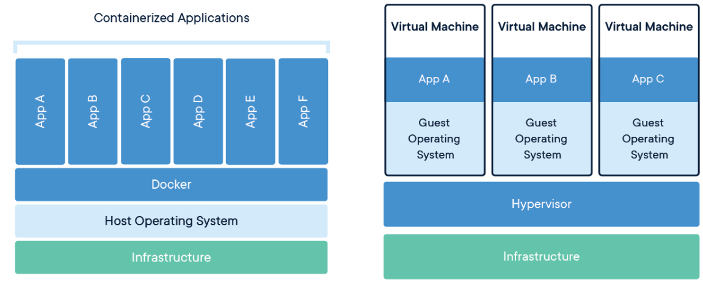
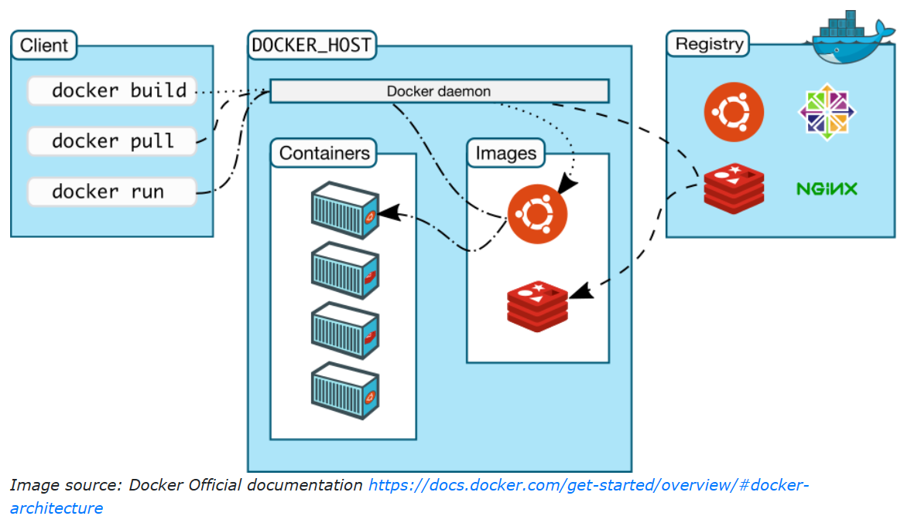
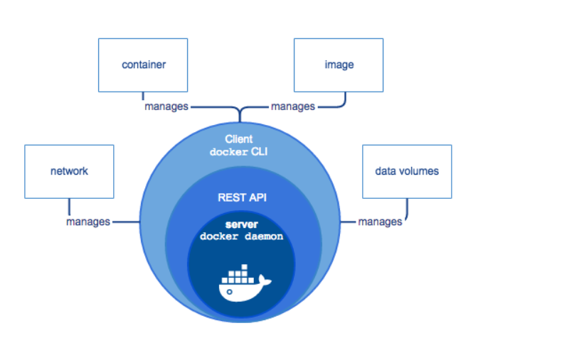

# 🐳 Docker: Introduction And Architecture

## Introduction

Docker is an open container management platform. It is a software platform for developing, shipping, and running applications based on containers—small and lightweight execution environments that make shared use of the operating system kernel and run in isolation from one another. Docker enables you to separate your applications from your infrastructure, allowing for rapid software delivery. 🚀

With Docker, you can manage your infrastructure in the same ways you manage your applications. By taking advantage of Docker's methodologies for shipping, testing, and deploying code quickly, you can significantly reduce the delay between writing code and running it in production. ⏱️

## Real Experience with Docker

Let me share my real experience of the first time I needed Docker in my career. I was assigned the task of validating the source code of two applications simultaneously. The first application had a dependency on `pywinrm 1.1`, and the second one required `pywinrm 2.2`. This presented a challenge: I could only test one application at a time due to the conflicting dependencies. 🤔

One solution could have been to create two Virtual Machines (VMs) and install each application on a separate VM. However, VMs consume a lot of memory and resources from the host machine. 💻

This is where I turned to containerization. By using Docker, I was able to run both applications in isolated containers, each with its own environment, without the overhead of full VMs. This approach not only saved resources but also streamlined my workflow, allowing me to test both applications simultaneously on the same host machine. 🎯
VMs vs Containers

## VMs vs Containers

# 💻 What is a Virtual Machine?

A **Virtual Machine (VM)** is a system that behaves exactly like a physical computer. VMs are like physical hardware, allowing a single server to act as multiple servers. This is made possible by a technology called the **hypervisor**, which enables multiple VMs to run on a single physical machine. Each VM has its own full copy of an operating system, along with the necessary applications, binaries, and libraries. VMs are known for being bulky in nature due to this setup. 🖥️

## Key Features of Virtual Machines

- **Full Operating System**: Each VM includes a complete OS with its own memory management, which adds the overhead of virtual device drivers. This setup ensures that each VM operates independently, as if it were a separate physical computer. 🏠

- **Resource Emulation**: In a VM, valuable resources are emulated for the guest OS and hypervisor, making it possible to run multiple instances of one or more operating systems in parallel on a single machine (host). This means every guest OS functions as an independent entity, separate from the host system. 🛠️

- **Isolation**: Since each VM operates independently, it's like having a fully-fledged house where no resources are shared with others. This isolation ensures that the performance and stability of one VM do not affect others running on the same host. 🔒

# 📦 What are Containers?

In modern software development, applications often require a large number of libraries, packages, dependencies, and other software components to run. Managing and maintaining these heavy applications in isolated clusters, without interfering with each other’s operations, is a major challenge. One solution to this problem is **Virtual Machines (VMs)**, which keep applications on the same hardware entirely separate, reducing conflicts among software components. However, VMs are bulky because they require their own OS, making them difficult to maintain and upgrade. 🖥️

## Containers: A Better Solution

**Containers** provide a more efficient solution by isolating application environments from one another while sharing the underlying OS kernel. Containers are an abstraction at the application layer that packages code and its dependencies together. By default, a container is well isolated from other containers and the host machine, but you can control the level of isolation for network, storage, or other subsystems. 🛠️

- **Shared OS Kernel**: Unlike VMs, which require a full OS for each instance, containers share the OS kernel with the host machine and other containers. This makes containers much lighter—container images are typically only tens of MBs in size. 📁

- **Efficiency**: Containers can run multiple applications on the same machine with greater efficiency, as they take up less space and require fewer VMs and operating systems compared to traditional VM setups. 🚀

## Docker Containers

When we talk specifically about **Docker containers**, they are executed with the Docker engine instead of a hypervisor. This makes Docker containers smaller than VMs, enables faster startup times, and offers better performance. However, this also means less isolation but greater compatibility, due to the sharing of the host's kernel. Think of Docker containers as apartments in a housing society, where resources like water, electricity, and security are shared among all residents. 🏢

# ⚖️ Docker vs Virtual Machines: Key Differences

## OS and Architecture

- **Virtual Machines (VMs)**: VMs have a host OS and a guest OS inside each VM. The guest OS can be any OS, like Linux or Windows, regardless of the host OS.

- **Docker Containers**: Docker containers run on a single physical server with a host OS shared among them. Since containers share the host OS, they are lighter and have faster boot times. 🚀

## Portability

- **Virtual Machines**: VMs are isolated from their OS, making them less portable across different platforms.
- **Docker Containers**: Docker containers are self-contained and can easily be ported across different platforms. They can run applications in any environment without needing a guest OS. 🌍

## Performance

- **Virtual Machines**: VMs are bulkier than Docker containers because they need to load an entire OS to start.

- **Docker Containers**: Docker containers are lightweight as they do not require a guest OS, resulting in faster startup times and better performance. ⚡

## 🛠️ Container Advantages

- **Lightweight and Easy to Manage**: Docker containers are easier to build, maintain, and port compared to VMs.
- **Agility**: Containers are more agile than VMs, allowing for quicker development and deployment cycles. 🚀
- **Hybrid and Multi-Cloud Adoption**: Containers enable easier adoption of hybrid and multi-cloud environments.
- **Integration with IT Processes**: Containers can be seamlessly integrated with existing IT processes, enhancing overall efficiency.

- **Cost Savings**: Containers save on VM licensing costs by reducing the need for multiple VMs. 💰
- **Popularity**: Containers are increasingly popular because they offer better flexibility, tenability, and isolation than VMs.

## ❌ Virtual Machine Disadvantages

- **Resource Intensive**: VMs contain full copies of an OS, along with the application, necessary binaries, and libraries, taking up tens of GBs of space.
- **Slow Boot Times**: VMs can be slow to boot, whereas Docker containers are much faster due to their lightweight architecture. ⏱️

- **Space Efficiency**: Docker containers take up less space (images are usually only tens of MBs), handle more applications, and use fewer VMs and Operating Systems.

# 🐳 What is Docker?

**Docker** is an open-source platform that simplifies the creation, deployment, and management of containers and container-based applications. It allows developers to package applications and their dependencies into a standardized unit called a **container**, which can run consistently across different computing environments. 🌐

To understand how Docker works, let's dive into its architecture and some of the key components used to create Docker-containerized applications.

## Docker's Core Technology

Docker is written in the **Go** programming language and leverages a technology called **namespaces** to provide isolated workspaces known as containers. When you run a container, Docker creates a set of namespaces for it. These namespaces act as a layer of isolation, ensuring that each container operates within its own environment, with limited access to other namespaces. 🔒

## Docker Architecture

Docker uses a **client-server architecture** to manage containers:

- **Docker Client**: This is the interface through which users interact with Docker. The client communicates with the Docker daemon to carry out various tasks like building, running, and distributing containers.

- **Docker Daemon**: The Docker daemon (dockerd) is the core service that runs on the host machine. It listens for Docker API requests and manages Docker objects such as images, containers, networks, and volumes.
- **Communication**: The Docker client and daemon communicate using a REST API, which can operate over UNIX sockets or a network interface. This allows Docker to function both locally and remotely. 🔗

# 🐳 Docker Components Overview

## Docker Daemon

The **Docker daemon** (`dockerd`) is the core service that powers Docker. It listens for Docker API requests and manages Docker objects such as images, containers, networks, and volumes. The daemon can also communicate with other Docker daemons to manage distributed Docker services, making it an essential component for orchestrating and maintaining Docker environments. 🛠️

## Docker Client

The **Docker client** (`docker`) is the primary tool that most Docker users interact with. It allows you to run commands like `docker run`, `docker pull`, and `docker push`. When you execute these commands, the Docker client sends them to the Docker daemon (`dockerd`) using the Docker API, which then executes the necessary operations. This client-server communication is what drives the Docker ecosystem. 💻

## Docker Registries

A **Docker registry** is a storage system for Docker images. Docker Hub is the default public registry where users can store and share images, but you can also run your own private registry. When you use the `docker pull` or `docker run` commands, Docker retrieves the required images from the configured registry. Conversely, when you use the `docker push` command, your image is uploaded to your designated registry. 📦

### Docker Hub

- **Docker Hub** is the default public registry that anyone can use.

- You can also create and manage your own **private registry** for internal use.

## Docker Images

A **Docker image** is a read-only template with instructions for creating a Docker container. For example, you could create an image based on the Ubuntu image that includes an Apache web server, your application, and all the necessary configurations to run it. 🌐

### Creating Docker Images

- **Dockerfile**: To build a custom image, you use a `Dockerfile`, which contains a simple syntax to define the steps needed to create the image. Each instruction in the `Dockerfile` creates a layer in the image.

- **Layered Approach**: When you modify a `Dockerfile` and rebuild the image, only the layers that have changed are rebuilt, making Docker images lightweight, small, and fast compared to traditional virtualization technologies. 🚀
